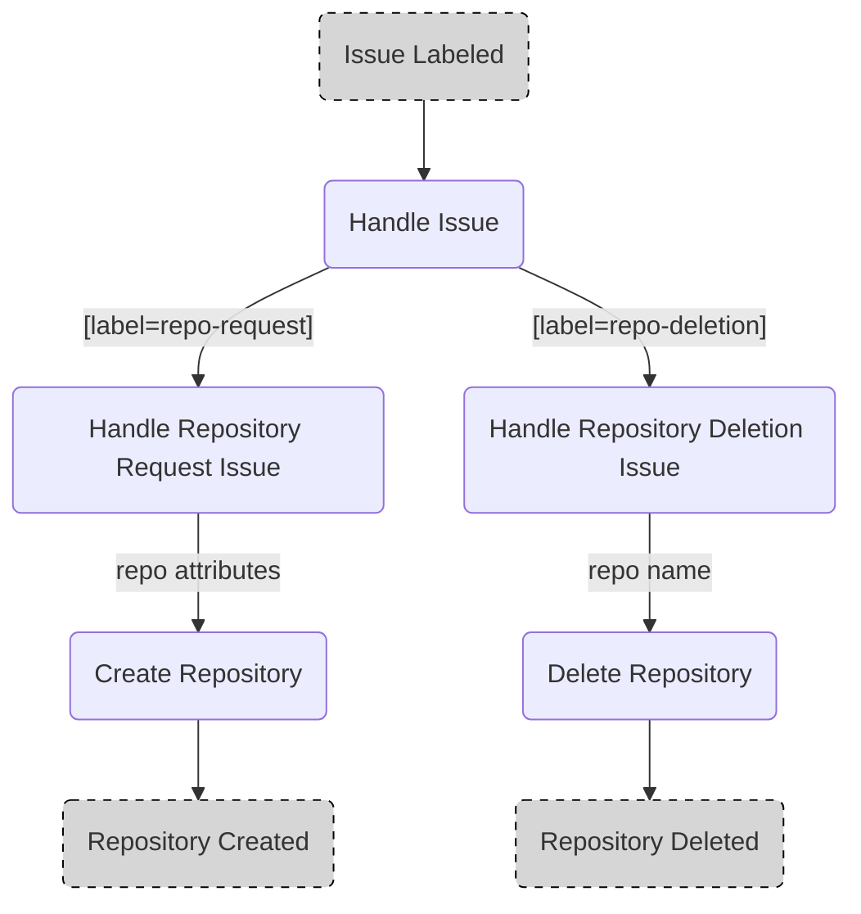

# Demo Repository for IssueOps

Project demonstrating the power of issue based process handling using GitHub issues and actions.

## Prerequisites

The repository has to meet several requirements that currently have to be set up manually:

- Issue Labels
- Environments
- GitHub App
- Variables
- Secrets

### Issue Labels

The following issue labels have to be created:

- `repo-request`
- `repo-deletion`

### Environments

The following environments have to be set up:

#### deletion

The deletion environment is used to enforce a workflow review before repository deletion.
Therefore the environment has to be set up to require reviews (see [docs](https://docs.github.com/en/actions/managing-workflow-runs/reviewing-deployments) to find out how to do this).

### GitHub App

A github app with the following permissions is required:

`Read access to metadata`
`Read and write access to administration, code, and issues`

### Variables

The following variables have to be configured:

| Key        | Description                                 |
| ---------- | ------------------------------------------- |
| GH_APP_KEY | Secret key of the [GitHub App](#github-app) |

### Secrets

The following variables have to be configured:

| Key          | Description                         |
| ------------ | ----------------------------------- |
| GH_APP_ID    | ID of the [GitHub App](#github-app) |
| ORGANIZATION | GitHub organization                 |

## Issue Templates

### Repository Management

#### Repository Request: [repo-request.yml](.github/ISSUE_TEMPLATE/repo-request.yml)

Issue provising several inputs and dropdown selections to collect data required for repository creation via [workflow](#handle-repository-request-handle-repo-requestyml).

The dropdown selections are automatically updated by the [repo request update](#update-repo-request-issue-template-update-repo-request-templateyml) workflow.

#### Repository Deletion: [repo-deletion.yml](.github/ISSUE_TEMPLATE/repo-deletion.yml)

Simple issue form taking the name of the repository as input which is supposed to be deleted via [workflow](#handle-repository-deletion-handle-repo-deletionyml).

## Workflows

### Issue Handling

Issues are handled in a three-tiered workflow.

1. Select the right workflow based on an issue label
1. Handle the issue and its data
1. Handle the corresponding task



#### Handle Issue: [handle-issue.yml](.github/workflows/handle-issue.yml)

Workflow handling the [issue templates](#issue-templates).
Depending on the given [label](https://docs.github.com/issues/using-labels-and-milestones-to-track-work/managing-labels) the workflow executes the corresponding [subworkflow](https://docs.github.com/actions/using-workflows/reusing-workflows).

The following subworkflows may be triggered:
- [Repository request](#handle-repository-request-handle-repo-requestyml)
- [Repository deletion](#handle-repository-deletion-handle-repo-deletionyml)

#### Handle Repository Request: [handle-repo-request.yml](.github/workflows/handle-repo-request.yml)

Workflow parsing the [repository request](#repository-request-repo-requestyml) issue data and commenting / closing the issue depending on the workflow success.

The workflow further triggers the [repository creation](#create-repository-repo-creationyml) workflow.

#### Handle Repository Deletion: [handle-repo-deletion.yml](.github/workflows/handle-repo-deletion.yml)

Workflow parsing the [repository deletion](#repository-deletion-repo-deletionyml) issue data and commenting / closing the issue depending on the workflow success.

The workflow further triggers the [repository deletion](#delete-repository-repo-deletionyml) workflow.

#### Create Repository: [repo-creation.yml](.github/workflows/repo-creation.yml)

Workflow creating a repository from template data.

#### Delete Repository: [repo-deletion.yml](.github/workflows/repo-deletion.yml)

Workflow deleting a repository by name.

### Organization Management

#### Update Repo Request Issue Template: [update-repo-request-template.yml](.github/workflows/update-repo-request-template.yml)

Workflow that is triggered by any changes to the workflow file `.github/workflows/update-repo-request-template.yml` or the `./org` or `./templates/languages` directories. The workflow reads the contents from the folder expecting the following structure:

```
.
├── org/
│   ├── company-1/
│   │   ├── metadata.yml
│   │   └── teams/
│   │       └── team-1/
│   │           ├── metadata.yml
│   │           └── projects/
│   │               ├── project-1/
│   │               └── project-2/
│   └── company-n/
│       ├── metadata.yml
│       └── teams/
│           └── team-n/
│               └── metadata.yml/
│                   └── projects/
│                       └── project-n/
└── templates/
    └── languages/
        ├── language-1/
        │   ├── README.md
        │   └── language-files
        └── language-n/
            ├── README.md
            └── language-files
```

The `org` is defined of a set of `company` which has a set of `teams`. Each team has a set of `projects`. In order to define the general properties on `company` as well as `team` level, each of those has a `metadata.yml`. This file holds properties such as team manager or team identifier.

Any change to the structure will trigger the workflow and populate the issue template.

## Actions

### Issue Handling

#### [comment-issue](.github/actions/comment-issue/action.yml)

Action adding a comment on a given issue.

The actions uses the [GitHub CLI](https://cli.github.com/) so provide an environment variable called [`GH_TOKEN`](https://cli.github.com/manual/gh_auth_login) with permissions to comment issues.

Example usage:
```yaml
jobs:
  comment:
    name: "Create a test comment"
    runs-on: ubuntu-latest
    env:
      GH_TOKEN: ${{ github.token }}
    steps:
      - uses: actions/checkout@v3.3.0
      - uses: ./.github/actions/comment-issue
      with:
        issue: 42
        message: "This is a test"
```

#### [close-issue](.github/actions/close-issue/action.yml)

Action closing a given issue adding a comment.

The actions uses the [GitHub CLI](https://cli.github.com/) so provide an environment variable called [`GH_TOKEN`](https://cli.github.com/manual/gh_auth_login) with permissions to close issues.

Example usage:
```yaml
jobs:
  comment:
    name: "Close a test issue"
    runs-on: ubuntu-latest
    env:
      GH_TOKEN: ${{ github.token }}
    steps:
      - uses: actions/checkout@v3.3.0
      - uses: ./.github/actions/close-issue
      with:
        issue: 42
        message: "Yes we did it!"
        reason: "completed"
```

## Queries

### jq

#### Create repo name

```
COMPANY=$(cat [issue-body] | jq -r '.Company' | sed 's/ (.*)//g' | sed 's/ /-/g' | tr '[:upper:]' '[:lower:]')

TEAM=$(cat [issue-body] | jq -r '.Team' | sed 's/-.*//g' | sed 's/ /-/g' | tr '[:upper:]' '[:lower:]')

PROJECT=$(cat [issue-body] | jq -r '.Project' | sed 's/ /-/g' | tr '[:upper:]' '[:lower:]')

RNAME=$(cat [issue-body] | jq -r '.Name' | sed 's/ /-/g' | tr '[:upper:]' '[:lower:]')

REPO=${COMPANY}-${TEAM}-${PROJECT}-${RNAME}
```

### yq

#### Replace companies, teams & projects

testing:

```
# Companies
COMPANIES=$(find ./org/companies -mindepth 1 -maxdepth 1 -type d -exec sh -c 'echo - $(basename "$1") \($(yq '.number' "$1"/metadata.yml)\)' sh {} \; | sort) yq '(.body[] | select(.type=="dropdown" and .attributes.label=="Company") | .attributes.options) |=env(COMPANIES)' .github/ISSUE_TEMPLATE/repo-request.yml

# Teams
TEAMS=$(find ./org/companies/*/teams -mindepth 1 -maxdepth 1 -type d -exec sh -c 'echo - $(yq '.id' "$1"/metadata.yml)-$(basename "$1")' sh {} \; | sort) yq '(.body[] | select(.type=="dropdown" and .attributes.label=="Team") | .attributes.options) |=env(TEAMS)' .github/ISSUE_TEMPLATE/repo-request.yml

# Projects
PROJECTS=$(find ./org/companies/*/teams/*/projects -mindepth 1 -maxdepth 1 -type d -exec sh -c 'echo - $(basename "$1")' sh {} \; | sort) yq '(.body[] | select(.type=="dropdown" and .attributes.label=="Project") | .attributes.options) |=env(PROJECTS)' .github/ISSUE_TEMPLATE/repo-request.yml
```