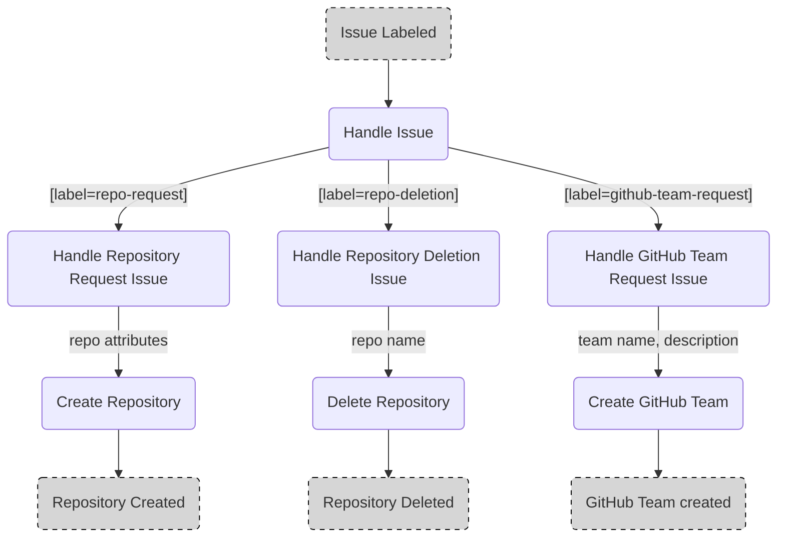

# Demo Repository for IssueOps

Project demonstrating the power of issue based process handling using GitHub issues and actions.

## Prerequisites

The repository has to meet several requirements that currently have to be set up manually:

- Issue Labels
- Environments
- GitHub App
- Variables
- Secrets

### Issue Labels

The following issue labels have to be created:

- `repo-request`
- `repo-deletion`
- `github-team-request`

### Environments

The following environments have to be set up:

#### deletion

The deletion environment is used to enforce a workflow review before repository deletion.
Therefore, the environment has to be set up to require reviews (see [docs](https://docs.github.com/en/actions/managing-workflow-runs/reviewing-deployments) to find out how this can be achieved).

#### github-team

The github-team environment is used to enforce a workflow review before team creation.
Therefore, the environment has to be set up to require reviews (see [docs](https://docs.github.com/en/actions/managing-workflow-runs/reviewing-deployments) to find out how this can be achieved).

### GitHub App

A GitHub app with the following permissions is required:

- `Read access to metadata`
- `Read and write access to administration, code, issues and members`

It is possible to perform git operations using the apps identity. Retrieve the required username and email as follows:

```bash
# replace with your app name
APP_NAME=xpirit-training-bot

# create user name
USER=${APP_NAME}[bot]

# retrieve app ID from github
ID=$(curl -s -g https://api.github.com/users/$USER | jq '.id')

# display data
echo
echo CI_COMMIT_USER=$USER
echo CI_COMMIT_USER_MAIL=$ID+$USER@users.noreply.github.com
```
As an alternative, the user name and email can be fetched via browser as well. Open a browser and use the following url

`
https://api.github.com/users/{name-of-github-app}[bot]
`

where `{name-of-github-app}` is the name assigned to the app in the respective app settings. It is important that `[bot]` follows the name of the app.

The request returns a JSON that is displayed in the browser. From that request the value of the key `"id"` is required to assemble the user name and email address as following

*User Name*

`
{name-of-github-app}[bot]
`

*User Email*

`
{user-id}+{name-of-github-app}[bot]@users.noreply.github.com
`

where `{user-id}` is the value of the response key `"id"` and `{name-of-github-app}` is the name of the app. Remember to add `[bot]`.

### Secrets

The following secrets have to be configured:

| Key        | Description                                  |
| ---------- | -------------------------------------------- |
| GH_APP_KEY | Private key of the [GitHub App](#github-app) |

### Variables

The following variables have to be configured:

| Key                 | Description                                |
| ------------------- | ------------------------------------------ |
| GH_APP_ID           | ID of the [GitHub App](#github-app)        |
| ORGANIZATION        | GitHub organization                        |
| CI_COMMIT_USER      | Name of the user for automated git tasks*  |
| CI_COMMIT_USER_MAIL | Email of the user for automated git tasks* |

*check [GitHub App](#github-app) to see how to retrieve them

## Issue Templates

### Repository Management

#### Repository Request: [repo-request.yml](.github/ISSUE_TEMPLATE/repo-request.yml)

Issue provising several inputs and dropdown selections to collect data required for repository creation via [workflow](#handle-repository-request-handle-repo-requestyml).

The dropdown selections are automatically updated by the [repo request update](#update-repo-request-issue-template-update-repo-request-templateyml) workflow.

#### Repository Deletion: [repo-deletion.yml](.github/ISSUE_TEMPLATE/repo-deletion.yml)

Simple issue form taking the name of the repository as input which is supposed to be deleted via [workflow](#handle-repository-deletion-handle-repo-deletionyml).

#### GitHub Team Request: [github-team-request.yml](.github/ISSUE_TEMPLATE/github-team-request.yml)

Simple issue form taking the name and the description of the GitHub team as input which is supposed to be created via [workflow](#handle-github-team-request-handle-github-team-requestyml).

## Workflows

### Issue Handling

Issues are handled in a three-tiered workflow.

1. Select the right workflow based on an issue label
1. Handle the issue and its data
1. Handle the corresponding task



#### Handle Issue: [handle-issue.yml](.github/workflows/handle-issue.yml)

Workflow handling the [issue templates](#issue-templates).
Depending on the given [label](https://docs.github.com/issues/using-labels-and-milestones-to-track-work/managing-labels) the workflow executes the corresponding [subworkflow](https://docs.github.com/actions/using-workflows/reusing-workflows).

The following subworkflows may be triggered:
- [Repository request](#handle-repository-request-handle-repo-requestyml)
- [Repository deletion](#handle-repository-deletion-handle-repo-deletionyml)
- [GitHub team request](#handle-github-team-request-handle-github-team-requestyml)

#### Handle Repository Request: [handle-repo-request.yml](.github/workflows/handle-repo-request.yml)

Workflow parsing the [repository request](#repository-request-repo-requestyml) issue data and commenting / closing the issue depending on the workflow success.

The repository name is created with the following pattern:

`[team name]-[repo name]`

**Example:**

```
Repo: Romani Ite Domum
Team: Peoples Front

Full Repo Name: peoples-front-romani-ite-domum
```

The workflow further triggers the [repository creation](#create-repository-repo-creationyml) workflow.

#### Handle Repository Deletion: [handle-repo-deletion.yml](.github/workflows/handle-repo-deletion.yml)

Workflow parsing the [repository deletion](#repository-deletion-repo-deletionyml) issue data and commenting / closing the issue depending on the workflow success.

The workflow further triggers the [repository deletion](#delete-repository-repo-deletionyml) workflow.

#### Handle GitHub Team Request: [handle-github-team-request.yml](.github/workflows/handle-github-team-request.yml)

Workflow parsing the [github team request](#handle-github-team-request-handle-github-team-requestyml) issue data and commenting / closing the issue depending on the workflow success.

The workflow further triggers the [github team request](#create-github-team-github-team-requestyml) workflow.

#### Create Repository: [repo-creation.yml](.github/workflows/repo-creation.yml)

Workflow creating a repository from template data.

#### Delete Repository: [repo-deletion.yml](.github/workflows/repo-deletion.yml)

Workflow deleting a repository by name.

#### Create GitHub Team: [github-team-request.yml](.github/workflows/github-team-request.yml)

Workflow creating a team from name and description on GitHub.

### Organization Management

#### Update Repo Request Issue Template: [update-repo-request-template.yml](.github/workflows/update-repo-request-template.yml)

Workflow to update dropdown selections in the [Repo Request Issue Template](.github/workflows/update-repo-request-template.yml).

The following selection data will be updated:

- Teams
- Languages

The workflow is triggered by any changes to the workflow file `.github/workflows/update-repo-request-template.yml` or the `./templates/languages` directory and also runs each day at midnight to update eventual changes to the team structure.

The workflow reads the contents from the `./templates/languages` folder expecting the following structure:

```
.
├── templates/
    └── languages/
        ├── language-1/
        │   ├── README.md
        │   └── language-files
        └── language-n/
            ├── README.md
            └── language-files
```

Any change to the structure will trigger the workflow and populate the issue template.

## Actions

### Issue Management

#### [comment-issue](.github/actions/comment-issue/action.yml)

Action adding a comment on a given issue.

The actions uses the [GitHub CLI](https://cli.github.com/) so provide a `token` with sufficient permissions.

Example usage:
```yaml
jobs:
  comment:
    name: "Create a test comment"
    runs-on: ubuntu-latest
    steps:
      - uses: actions/checkout@v3.3.0
      - name: Get Token From GitHub App
        id: get-workflow-token
        uses: peter-murray/workflow-application-token-action@v2
        with:
          application_id: ${{ vars.GH_APP_ID }}
          application_private_key: ${{ secrets.GH_APP_KEY }}
          organization: ${{ vars.ORGANIZATION }}
      - uses: ./.github/actions/comment-issue
        with:
          token: ${{ steps.get-workflow-token.outputs.token }}
          issue: 42
          message: "This is a test"
```

#### [close-issue](.github/actions/close-issue/action.yml)

Action closing a given issue adding a comment.

The actions uses the [GitHub CLI](https://cli.github.com/) so provide a `token` with sufficient permissions.

Example usage:
```yaml
jobs:
  comment:
    name: "Close a test issue"
    runs-on: ubuntu-latest
    steps:
      - uses: actions/checkout@v3.3.0
      - name: Get Token From GitHub App
        id: get-workflow-token
        uses: peter-murray/workflow-application-token-action@v2
        with:
          application_id: ${{ vars.GH_APP_ID }}
          application_private_key: ${{ secrets.GH_APP_KEY }}
          organization: ${{ vars.ORGANIZATION }}
      - uses: ./.github/actions/close-issue
        with:
          token: ${{ steps.get-workflow-token.outputs.token }}
          issue: 42
          message: "Yes we did it!"
          reason: "completed"
```

### Organization Management

#### [get-teams](.github/actions/get-teams/action.yml)

Action retrieving the teams of an organization as JSON array.

The actions uses the [GitHub CLI](https://cli.github.com/) so provide a `token` with sufficient permissions.

Example usage:
```yaml
jobs:
  comment:
    name: "Get Teams Of Organization"
    runs-on: ubuntu-latest
    steps:
      - uses: actions/checkout@v3.3.0
      - name: Get Token From GitHub App
        id: get-workflow-token
        uses: peter-murray/workflow-application-token-action@v2
        with:
          application_id: ${{ vars.GH_APP_ID }}
          application_private_key: ${{ secrets.GH_APP_KEY }}
          organization: ${{ vars.ORGANIZATION }}
      - uses: ./.github/actions/get-teams
        id: get-teams
        with:
          token: ${{ steps.get-workflow-token.outputs.token }}
          organization: ${{ vars.ORGANIZATION }}
      - name: Display Teams
        run: echo ${{ steps.get-teams.outputs.json }}
```

#### [grant-permission-team](.github/actions/grant-permission-team/action.yml)

Action granting a team permission to a repository

The actions uses the [GitHub CLI](https://cli.github.com/) so provide a `token` with sufficient permissions.

Example usage:
```yaml
jobs:
  comment:
    name: "Grant Team Permission"
    runs-on: ubuntu-latest
    steps:
      - uses: actions/checkout@v3.3.0
      - name: Get Token From GitHub App
        id: get-workflow-token
        uses: peter-murray/workflow-application-token-action@v2
        with:
          application_id: ${{ vars.GH_APP_ID }}
          application_private_key: ${{ secrets.GH_APP_KEY }}
          organization: ${{ vars.ORGANIZATION }}
      - uses: ./.github/actions/grant-permission-team
        with:
          organization: united-states
          team: president
          repository: nuclear-codes 
          permission: read
          token: ${{ steps.get-workflow-token.outputs.token }}
```

### Repository Management

#### [add-topics](.github/actions/add-topics/action.yml)

Action adding topics to a repository

The actions uses the [GitHub CLI](https://cli.github.com/) so provide a `token` with sufficient permissions.

Example usage:
```yaml
jobs:
  comment:
    name: "Add Topics To Repository"
    runs-on: ubuntu-latest
    steps:
      - uses: actions/checkout@v3.3.0
      - name: Get Token From GitHub App
        id: get-workflow-token
        uses: peter-murray/workflow-application-token-action@v2
        with:
          application_id: ${{ vars.GH_APP_ID }}
          application_private_key: ${{ secrets.GH_APP_KEY }}
          organization: ${{ vars.ORGANIZATION }}
      - uses: ./.github/actions/add-topics
        with:
          owner: jeffrey-lebowski
          repository: white-russian
          topics: 'the-real-dude,that-rug-really-tied-the-room-together'
          token: ${{ steps.get-workflow-token.outputs.token }}
```